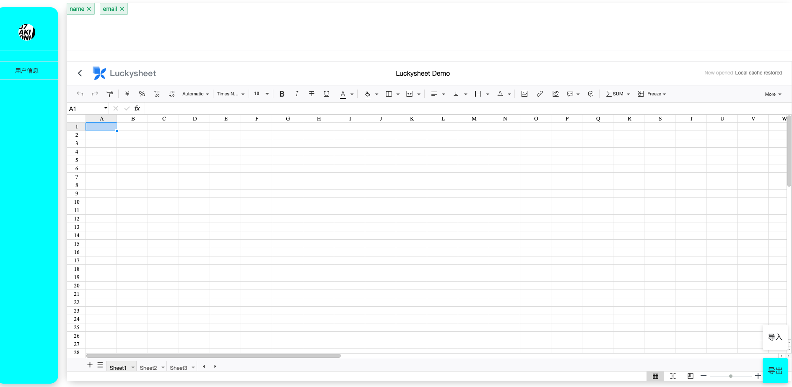
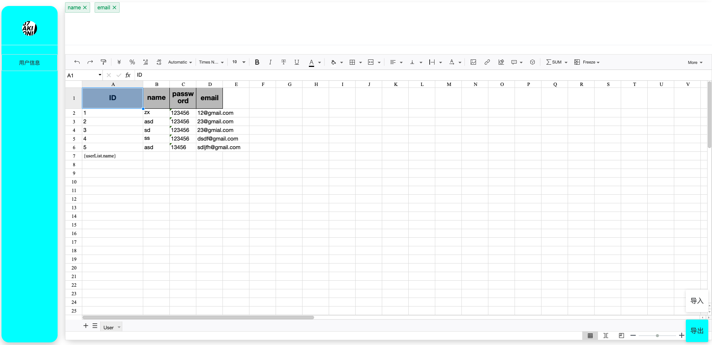
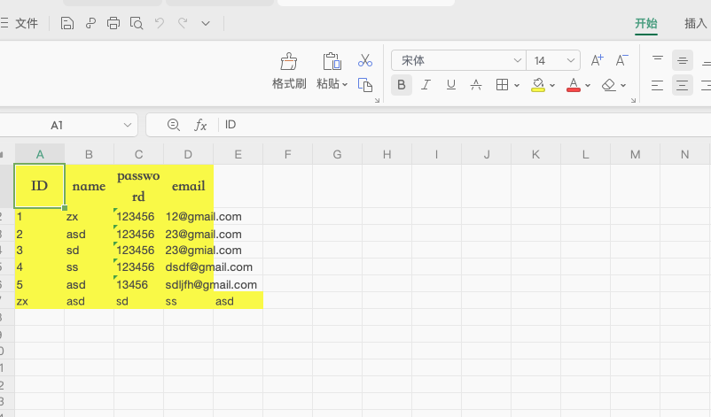

# Easyexcel

本项目使用Easyexcel对excel表格进行处理，后端主要实现导入和导出excel并且实现表格的横向填充；前端主要是用LuckyExcel
来实现表格的展示以及导出；主要是导出数据库中的信息。

## 后端实现

```
<dependency>
    <groupId>com.alibaba</groupId>
    <artifactId>easyexcel</artifactId>
    <version>3.1.1</version>
</dependency>
```

后端主要功能是横向填充

```
@PostMapping("/excel/file")
    @Operation(description = "填充Excel表格")
    public void fillTemplate(@RequestParam(value = "file" , required = true) MultipartFile file, HttpServletResponse response) {
        try {
            response.reset();
            response.setContentType("application/vnd.ms-excel");
            response.setHeader("Content-Disposition",
                    "attachment;filename=user_excel_" + System.currentTimeMillis() + ".xls");
            userService.fillExcelTemplate(response.getOutputStream(),file);
        } catch (Exception e){
            e.printStackTrace();
        }
    }

```

最后直接返回Bold格式的数据；


## 前端实现

主要包


```
npm install luckyexcel
```

此处我采用CDN的方式进行导入

```
<link rel='stylesheet' href='https://cdn.jsdelivr.net/npm/luckysheet@latest/dist/plugins/css/pluginsCss.css' />
    <link rel='stylesheet' href='https://cdn.jsdelivr.net/npm/luckysheet@latest/dist/plugins/plugins.css' />
    <link rel='stylesheet' href='https://cdn.jsdelivr.net/npm/luckysheet@latest/dist/css/luckysheet.css' />
    <link rel='stylesheet' href='https://cdn.jsdelivr.net/npm/luckysheet@latest/dist/assets/iconfont/iconfont.css' />
    <script src="https://cdn.jsdelivr.net/npm/luckysheet@latest/dist/plugins/js/plugin.js"></script>
    <script src="https://cdn.jsdelivr.net/npm/luckysheet@latest/dist/luckysheet.umd.js"></script> 
```

然后设置区域显示表格

```
<div id="luckysheet" class="luckysheet-wrap"></div>

.luckysheet-wrap {
  width: 100%;
  height: 85%;
}

//监听
onMounted(() => {
    fatchTitles();

    luckysheet.create({
    container: 'luckysheet'//这里需要和容器的id名称一致
  })
});
```

## 实现

上方可以显示数据库中存在的标签，下方是表格的展示



导入excel表格，并对其进行填充设置



导出Excel表格后，后端会对其进行自动填充

